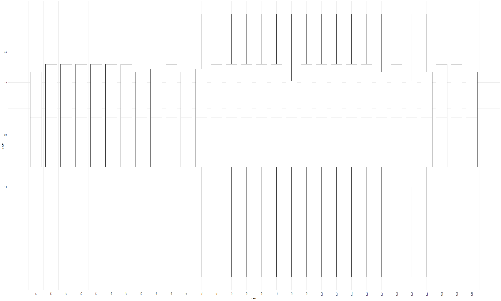

homework\_3
================
Yiyao LI

## Problem 1

``` r
data("instacart")
```

This dataset contains 1384617 rows and 15 columns.

Observations are the level of items in orders by user. There are
user/order variables – user ID, order ID, order day and order hour.
There are also item variables – name, aisle, department and some numeric
codes.

1.How many aisles and which are most items from?

``` r
instacart %>%
  count(aisle) %>%
  arrange(desc(n))
```

    ## # A tibble: 134 x 2
    ##    aisle                              n
    ##    <chr>                          <int>
    ##  1 fresh vegetables              150609
    ##  2 fresh fruits                  150473
    ##  3 packaged vegetables fruits     78493
    ##  4 yogurt                         55240
    ##  5 packaged cheese                41699
    ##  6 water seltzer sparkling water  36617
    ##  7 milk                           32644
    ##  8 chips pretzels                 31269
    ##  9 soy lactosefree                26240
    ## 10 bread                          23635
    ## # ... with 124 more rows

There are 134 aisles and most items are from fresh vegetables, the
number of which is 150609.

2.Make a plot.

``` r
instacart %>%
  count(aisle) %>%
  filter(n > 10000) %>% 
  mutate(
    aisle = factor(aisle),
    aisle = fct_reorder(aisle, n)
  ) %>%
  
  ggplot(aes(x = aisle, y = n)) +
  geom_point() + 
  theme(axis.text.x = element_text(angle = 90, vjust = 0.5, hjust=1))
```


Make a table

``` r
instacart %>%
  filter(aisle %in% c("baking ingredients", "dog food care", "packaged vegetables fruits")) %>%
  group_by(aisle) %>%
  count(product_name) %>%
  mutate(rank = min_rank(desc(n))) %>%
  filter(rank < 4) %>%
  arrange(aisle, rank) %>%
  knitr::kable()
```

| aisle                      | product\_name                                 |    n | rank |
| :------------------------- | :-------------------------------------------- | ---: | ---: |
| baking ingredients         | Light Brown Sugar                             |  499 |    1 |
| baking ingredients         | Pure Baking Soda                              |  387 |    2 |
| baking ingredients         | Cane Sugar                                    |  336 |    3 |
| dog food care              | Snack Sticks Chicken & Rice Recipe Dog Treats |   30 |    1 |
| dog food care              | Organix Chicken & Brown Rice Recipe           |   28 |    2 |
| dog food care              | Small Dog Biscuits                            |   26 |    3 |
| packaged vegetables fruits | Organic Baby Spinach                          | 9784 |    1 |
| packaged vegetables fruits | Organic Raspberries                           | 5546 |    2 |
| packaged vegetables fruits | Organic Blueberries                           | 4966 |    3 |

apples vs ice cream

``` r
instacart %>%
  filter(product_name %in% c("Pink Lady Apples", "Coffee Ice Cream")) %>%
  group_by(product_name,order_dow) %>%
  summarize(
    mean_hour = mean(order_hour_of_day)
  ) %>%
  pivot_wider(
    names_from = order_dow,
    values_from = mean_hour
  )
```

    ## `summarise()` regrouping output by 'product_name' (override with `.groups` argument)

    ## # A tibble: 2 x 8
    ## # Groups:   product_name [2]
    ##   product_name       `0`   `1`   `2`   `3`   `4`   `5`   `6`
    ##   <chr>            <dbl> <dbl> <dbl> <dbl> <dbl> <dbl> <dbl>
    ## 1 Coffee Ice Cream  13.8  14.3  15.4  15.3  15.2  12.3  13.8
    ## 2 Pink Lady Apples  13.4  11.4  11.7  14.2  11.6  12.8  11.9

## Problem 2

1):

Load the data

``` r
accel_data = read_csv("./data/accel_data.csv") %>% 
    janitor::clean_names()
```

    ## Parsed with column specification:
    ## cols(
    ##   .default = col_double(),
    ##   day = col_character()
    ## )

    ## See spec(...) for full column specifications.

Tidy the data

``` r
accel_tidy = 
  accel_data %>% 
  pivot_longer(
    activity_1:activity_1440,
    names_to = "minute",
    names_prefix = "activity_",
    values_to = "counts"
  ) %>% 
  mutate(weekdays_vs_weekand = case_when(day == "Monday" ~ "weekdays", day == "Tuesday" ~ "weekdays", day == "Wednesday" ~ "weekdays", day == "Thusday" ~ "weekdays", day == "Friday" ~ "weekdays", day =="Saturday" ~ "weekand", day == "Sunday" ~ "weekand"))
```

describe the dataset: The dataset is 50400 \* 6. There are six
variables. And there names are week, day\_id, day, minute, counts,
weekdays\_vs\_weekand. There are 50400 observations.

2):

A total activity variable for each day

``` r
accel_tidy %>%
  mutate(day = forcats::
         fct_relevel(day, c("Monday", "Tuesday", "Wednesday", "Thursday", "Friday", "Saturday", "Sunday"))) %>%
  group_by(week, day) %>%
  summarise(total_counts = sum(counts)) %>%
  pivot_wider(names_from = week,
              names_prefix = "week",
              values_from = total_counts) %>% 
  knitr::kable(digits = 0)
```

| day       |  week1 |  week2 |  week3 |  week4 |  week5 |
| :-------- | -----: | -----: | -----: | -----: | -----: |
| Monday    |  78828 | 295431 | 685910 | 409450 | 389080 |
| Tuesday   | 307094 | 423245 | 381507 | 319568 | 367824 |
| Wednesday | 340115 | 440962 | 468869 | 434460 | 445366 |
| Thursday  | 355924 | 474048 | 371230 | 340291 | 549658 |
| Friday    | 480543 | 568839 | 467420 | 154049 | 620860 |
| Saturday  | 376254 | 607175 | 382928 |   1440 |   1440 |
| Sunday    | 631105 | 422018 | 467052 | 260617 | 138421 |

Are any trends apparent? The activity counts on Saturday in week 4 and
week 5 are obviously less than those on other days. And I can’t tell any
trends just from this table.

make a graph

``` r
accel_plot = 
  accel_tidy %>%
  mutate(day = forcats::
           fct_relevel(day, c("Monday", "Tuesday", "Wednesday", "Thursday", "Friday", "Saturday", "Sunday"))) %>%
  mutate(
    minute = as.integer(minute),
    hour = (minute - 1) %/% 60) %>% 
  group_by(day_id, hour, day) %>%
  summarise(total_hour_accel = sum(counts))
```

    ## `summarise()` regrouping output by 'day_id', 'hour' (override with `.groups` argument)

``` r
accel_plot %>%
  ggplot(aes(x = hour, y = total_hour_accel, group = day_id)) +
  geom_line(aes(colour = day))
```


## Problem 3

load the data

``` r
data("ny_noaa")
ny_noaa = ny_noaa %>% 
    separate(date, c("year","month","day")) %>%
    mutate(across(year:tmin,as.numeric),
           tmax = tmax/10,
           tmin = tmin/10) %>%
    drop_na()
```

For snowfall, what are the most commonly observed values?

``` r
ny_noaa %>%
  group_by(snow) %>%
  summarize(n_obs = n())
```

    ## `summarise()` ungrouping output (override with `.groups` argument)

    ## # A tibble: 248 x 2
    ##     snow   n_obs
    ##    <dbl>   <int>
    ##  1   -13       1
    ##  2     0 1112758
    ##  3     3    5276
    ##  4     5    5669
    ##  5     8    5380
    ##  6    10    2943
    ##  7    13   12460
    ##  8    15    2144
    ##  9    18    1818
    ## 10    20    2503
    ## # ... with 238 more rows

The most commonly observed values are 0. The reason may be that it not
snow often in that area.

Plot of January

``` r
ny_noaa %>%
  group_by(month) %>% 
  filter(month == "1") %>% 
  group_by(year, id) %>%
  summarize(mean_tmax = mean(tmax)) %>% 
  drop_na() %>% 
  mutate(rank  = min_rank(desc(mean_tmax))) %>%
  ggplot(aes(x = year, y = mean_tmax, color = id)) + 
  geom_point() +
  geom_line() +
  theme(legend.position = 'none') +
  labs(title = "the average max temperature of different stations in January", x = "year", y = "average max temperature")
```

    ## `summarise()` regrouping output by 'year' (override with `.groups` argument)


Plot of July

``` r
ny_noaa %>%
  group_by(month) %>% 
  filter(month == "7") %>% 
  group_by(year, id) %>%
  summarize(mean_tmax = mean(tmax)) %>% 
  drop_na() %>% 
  mutate(rank  = min_rank(desc(mean_tmax))) %>%
  ggplot(aes(x = year, y = mean_tmax, color = id)) + 
  geom_point() +
  geom_line() +
  theme(legend.position = 'none') +
  labs(title = "the average max temperature of different stations in July", x = "year", y = "average max temperature")
```

    ## `summarise()` regrouping output by 'year' (override with `.groups` argument)


tmax vs tmin plot

``` r
ny_noaa %>%
  ggplot(aes(x = tmin, y = tmax, color = id)) +
  geom_line() +
  theme(legend.position = "none")
```


the distribution of snowfall

``` r
ny_noaa %>%
  filter(between(snow,1,100),
         !is.na(snow)) %>% 
  group_by(year) %>%
  ggplot(aes(x = year, y = snow, group = as.factor(year))) +
  geom_boxplot() +
  scale_y_continuous(trans = "log", breaks = c(10, 20,40,60)) +
  scale_x_continuous(breaks = seq(1981,2010,1)) +
  theme(axis.text.x = element_text(angle = 90, vjust = 0.5, hjust = 1))
```



The description of this dataset: This dataset is 1222433 \* 9. The key
variables are id, year, month, day, prcp, snow, snwd, tmax, tmin.
